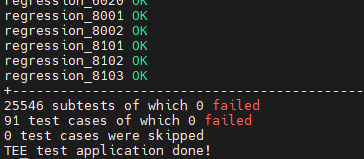

# RaspberryPi 3B安装OP-TEE

该文档将描述如何安装OP-TEE并在树莓派3B上运行。

------

### 安装环境

**虚拟机：ubuntu16.04 64位**

**硬盘大小： ** **建议20G以上**

**树莓派型号：RaspberryPi 3/3B**【注意：树莓派4B不支持】

**OP-TEE版本**：**v3.12.0**【v3.15.0尚未编译成功】

# Prerequisites

如果虚拟机之前没有安装过op-tee，那么需要安装以下的依赖包。

```C
$ sudo dpkg --add-architecture i386
$ sudo apt-get update
$ sudo apt-get install android-tools-adb android-tools-fastboot autoconf \
        automake bc bison build-essential ccache codespell \
        cscope curl device-tree-compiler \
        expect flex ftp-upload gdisk iasl libattr1-dev libcap-dev \
        libfdt-dev libftdi-dev libglib2.0-dev libgmp-dev libhidapi-dev \
        libmpc-dev libncurses5-dev libpixman-1-dev libssl-dev libtool make \
        mtools netcat ninja-build python-crypto python3-crypto python-pyelftools \
        python3-pycryptodome python3-pyelftools python-serial python3-serial \
        rsync unzip uuid-dev xdg-utils xterm xz-utils zlib1g-dev
```

其中，`python3-pycryptodome`这个包可能会报错，如果报错了，可以把这个包删除，然后再apt-get install。

# Installation

### repo init

为了快速安装我们需要的多个git仓库，可以使用optee官方提供的repo来快速获得所需要的git仓库。

**第一步**需要初始化optee官方提供的repo，该repo地址为

[OP-TEE/manifest: Manifests to use OP-TEE on various platforms (github.com)](https://github.com/OP-TEE/manifest)

需要新建一个文件夹，其中，<optee-project>替换为自己工程文件夹，并在该文件夹中输入repo init。

```C
$ mkdir -p <optee-project>
$ cd <optee-project>
$ repo init -u https://github.com/OP-TEE/manifest.git -m ${TARGET}.xml [-b ${BRANCH}] 
```

其中第3行的repo init可以`-m`后的参数可以指定硬件平台，因为我们想使用树莓派3，那么此处为rpi3，`-b`后的参数可以选择版本号，我们可以输入3.12.0。

```C
repo init -u https://github.com/OP-TEE/manifest.git -m rpi3.xml -b 3.12.0 
```


### repo sync

repo init成功后，需要进行repo sync来真正下载git仓库。命令为：

```C
$ repo sync -j4 --no-clone-bundle
```

我的repo源是https://gerrit.googlesource.com/git-repo，如果因为网络问题下载失败，可以重新repo init，带上参数 --repo-url=https://gerrit-googlesource.lug.ustc.edu.cn/git-repo【中科大的源】


然后再运行$ repo sync -j4 --no-clone-bundle。我这里出现了证书错误。


原因是不信任我本地的git账号，可以通过运行命令行$export GIT_SSL_NO_VERIFY=1，暂时将验证关闭。


### 安装toolchains

```C
$ cd <optee-project>/build
$ make -j2 toolchains
```

### make

```C
$ make -j4
```

### 烧写sd卡

运行 **$make img-help**，可以打印出如下的官方给的分区操作步骤。

```C
$ fdisk /dev/sdx   # where sdx is the name of your sd-card
   > p             # prints partition table
   > d             # repeat until all partitions are deleted
   > n             # create a new partition
   > p             # create primary
   > 1             # make it the first partition
   > <enter>       # use the default sector
   > +64M          # create a boot partition with 64MB of space
   > n             # create rootfs partition
   > p
   > 2
   > <enter>
   > <enter>       # fill the remaining disk, adjust size to fit your needs
   > t             # change partition type
   > 1             # select first partition
   > e             # use type 'e' (FAT16)
   > a             # make partition bootable
   > 1             # select first partition
   > p             # double check everything looks right
   > w             # write partition table to disk.

run the following as root
   $ mkfs.vfat -F16 -n BOOT /dev/sdx1
   $ mkdir -p /media/boot
   $ mount /dev/sdx1 /media/boot
   $ cd /media
   $ gunzip -cd /home/st/Desktop/Raspberry-optee3.12/build/../out-br/images/rootfs.cpio.gz | sudo cpio -idmv "boot/*"
   $ umount boot

run the following as root
   $ mkfs.ext4 -L rootfs /dev/sdx2
   $ mkdir -p /media/rootfs
   $ mount /dev/sdx2 /media/rootfs
   $ cd rootfs
   $ gunzip -cd /home/st/Desktop/Raspberry-optee3.12/build/../out-br/images/rootfs.cpio.gz | sudo cpio -idmv
   $ rm -rf /media/rootfs/boot/*
   $ cd .. && umount rootfs
```

按照上述过程给sd卡分区即可。

# 启动树莓派

先用usb-ttl线连接树莓派和电脑，tx对rx，rx对tx，波特率设置115200，其余默认。注意gnd和gnd也要连接，否则可能出现乱码。

上电后，通过putty或者picocom串口即可看到boot的log信息，boot完成后可以通过 **root** 账号或者 **test** 账号登陆。

### 运行xtest

启动后，可以通过xtest命令来对optee进行测试。树莓派命令行输入：

```c
 $ xtest
```

则会运行optee的测试，如果前面步骤均成功，则显示 0 failed。



### OP-TEE Demo

```c
$optee_example_hello_world // CA传递一个value给TA，TA将该value+1。
$optee_example_acipher         
$optee_example_aes             
$optee_example_hotp  
$optee_example_random
$optee_example_secure_storage // CA传递字符串给TA，TA将其存储在trustzone
```

# 树莓派配置以太网

个人配置的网络参数：

+ 设置树莓派ip地址：10.214.131.171
+ netmask：255.255.255.0
+ gateway：10.214.131.1
+ dns：10.10.0.21，10.10.0.8

```c
$ ifconfig eth0 10.214.131.171 netmask 255.255.255.0 //配置ip地址和子网掩码
$ route add default gw 10.214.131.1 //网关
$ echo "nameserver 10.10.0.21" > /etc/resolv.conf //dns
$ echo "nameserver 10.10.0.8" >> /etc/resolv.conf
```


# 参考

[build — OP-TEE documentation documentation (optee.readthedocs.io)](https://optee.readthedocs.io/en/3.15.0/building/gits/build.html#build)

[Raspberry Pi 3 — OP-TEE documentation documentation (optee.readthedocs.io)](https://optee.readthedocs.io/en/3.12.0/building/devices/rpi3.html)
