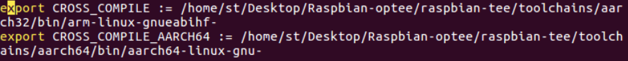
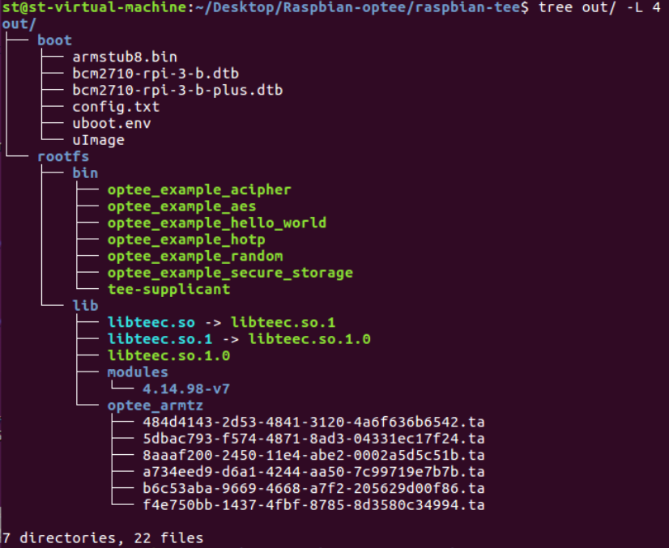
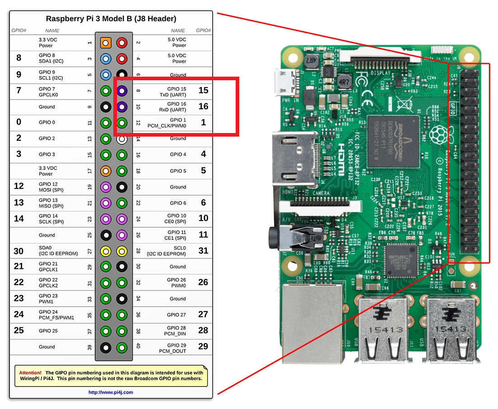

# Raspbian OS with OP-TEE

该文章该介绍如何在树莓派3B上运行Raspbian 和 OP-TEE。

## 环境

**虚拟机：**ubuntu16.04或更新

**交叉编译工具** Toolchain

**树莓派版本**：3B/3B+

**克隆仓库**

```
git clone https://github.com/benhaz1024/raspbian-tee.git
```

在 **config.mk** 文件里，将AARCH64和AARCH32路径修改成自己的toolchain路径



运行  **./prepare-env.sh** 

【 **如果尚未安装toolchains** 】可以通过make 以下Makefile文件进行安装。

```cmake
################################################################################
# Toolchains
################################################################################
ROOT				?= $(CURDIR)/..
TOOLCHAIN_ROOT 			?= $(ROOT)/toolchains

AARCH32_PATH 			?= $(TOOLCHAIN_ROOT)/aarch32
AARCH32_CROSS_COMPILE 		?= $(AARCH32_PATH)/bin/arm-linux-gnueabihf-
AARCH32_GCC_VERSION 		?= gcc-arm-9.2-2019.12-x86_64-arm-none-linux-gnueabihf
SRC_AARCH32_GCC 		?= https://developer.arm.com/-/media/Files/downloads/gnu-a/9.2-2019.12/binrel/$(AARCH32_GCC_VERSION).tar.xz

AARCH64_PATH 			?= $(TOOLCHAIN_ROOT)/aarch64
AARCH64_CROSS_COMPILE 		?= $(AARCH64_PATH)/bin/aarch64-linux-gnu-
AARCH64_GCC_VERSION 		?= gcc-arm-9.2-2019.12-x86_64-aarch64-none-linux-gnu
SRC_AARCH64_GCC 		?= https://developer.arm.com/-/media/Files/downloads/gnu-a/9.2-2019.12/binrel/$(AARCH64_GCC_VERSION).tar.xz

# Download toolchain macro for saving some repetition
# $(1) is $AARCH.._PATH		: i.e., path to the destination
# $(2) is $SRC_AARCH.._GCC	: is the downloaded tar.gz file
# $(3) is $.._GCC_VERSION	: the name of the file to download
define dltc
	@if [ ! -d "$(1)" ]; then \
		mkdir -p $(1); \
		echo "Downloading $(3) ..."; \
		curl -s -L $(2) -o $(TOOLCHAIN_ROOT)/$(3).tar.xz; \
		tar xf $(TOOLCHAIN_ROOT)/$(3).tar.xz -C $(1) --strip-components=1; \
		(cd $(1)/bin && for f in *-none-linux*; do ln -s $$f $${f//-none} ; done;) \
	fi
endef

.PHONY: toolchains
toolchains: aarch32 aarch64

.PHONY: aarch32
aarch32:
	$(call dltc,$(AARCH32_PATH),$(SRC_AARCH32_GCC),$(AARCH32_GCC_VERSION))

.PHONY: aarch64
aarch64:
	$(call dltc,$(AARCH64_PATH),$(SRC_AARCH64_GCC),$(AARCH64_GCC_VERSION))

CLANG_PATH			?= $(ROOT)/clang-9.0.1

# Download the Clang compiler with LLVM tools and compiler-rt libraries
define dl-clang
	@if [ ! -d "$(1)" ]; then \
		./get_clang.sh $(1); \
	else \
		echo "$(1) already exists"; \
	fi
endef

.PHONY: clang-toolchains
clang-toolchains:
	$(call dl-clang,$(CLANG_PATH))
```


## 编译

运行 **./prepare-env.sh** 后，会自动下载所需的git仓库。

下载完成后，命令行输入 **make patch**，打上补丁。

最后命令行输入 **make**。

这里可能会出现make指令报错：

```c
make[1]: Leaving directory '/home/st/Desktop/Raspbian-optee/raspbian-tee/linux'
mkimage -A arm -O linux -T kernel -C none -a 0x02000000 -e 0x02000000 -n "linux kernel image" -d /home/st/Desktop/Raspbian-optee/raspbian-tee/linux/arch/arm/boot/zImage /home/st/Desktop/Raspbian-optee/raspbian-tee/linux/arch/arm/boot/uImage
/bin/sh: mkimage: command not found
Makefile:157: recipe for target 'linux-uimage' failed
make: *** [linux-uimage] Error 127

```

解决办法：根据[编译内核提示mkimage command not found – U-Boot images will not be built_wiwa@tech-CSDN博客](https://blog.csdn.net/eibo51/article/details/51901480?utm_medium=distribute.pc_relevant.none-task-blog-2~default~baidujs_title~default-0.essearch_pc_relevant&spm=1001.2101.3001.4242.1)描述，通过“**sudo apt-get install u-boot-tools**”，即可make成功。

make需要一段时间，如果最后make成功，out文件夹里的文件如图所示。



## 烧写SD卡

### 烧写Raspbian os

在[Index of /raspbian/images (raspberrypi.org)](http://downloads.raspberrypi.org/raspbian/images/?C=N;O=D)该网站下有树莓派的所有历史镜像，选择其中的 **2019-07-12-raspbian-buster-lite.zip**，进行下载。下载完成后解压得到**2019-07-12-raspbian-buster-lite.img**。

将sd卡插入pc上，并使用以下任一烧写工具将镜像烧写在sd卡里即可

+ 树莓派官方烧写工具 **Raspberry Pi Imager**【[Raspberry Pi OS – Raspberry Pi](https://www.raspberrypi.com/software/)】
+ balenaEtcher【[balenaEtcher - Flash OS images to SD cards & USB drives](https://www.balena.io/etcher/)】

### 拷贝虚拟机里out文件夹里的文件

将带有Raspbian OS的sd卡挂载到虚拟机中，此时sd卡两个分区应该自动挂载到 /media/user/boot 和 /media/user/rootfs。【其中user为自己的用户名】

执行下面命令：

```c
$ sudo cp -rf ./out/boot* /media/user/boot
$ sudo cp -rf ./out/rootfs* /media/user/rootfs
```

拷贝完成后，进行umount。

```
$ sudo umount /dev/sdx1 // x 视自己设备名设定
$ sudo umount /dev/sdx2
```

## 启动树莓派3B

将sd卡插入树莓派中，并用usb转ttl线连接串口，如图连接uart。



pc机的uart波特率设置为115200，其余默认。

上电后，uart能打印boot信息。树莓派账号为 pi，密码为 raspberry。

**测试op-tee是否正常**

登录账号后，命令行输入

```c
$ ls /dev/tee* 
// 此时终端应能打印出 /dev/tee0 和 /dev/teepriv0
$ sudo tee-supplicant & 
// 这一步将optee在REE端的驱动放在后台运行
$ sudo optee_example_hello_world
// 这一步运行hello world例程，终端会打印出一系列信息和 数字43
```

如果上述过程没有任何异常，则raspbian和optee安装成功。

## 参考

[apply OPTEE to raspbian · Issue #3557 · OP-TEE/optee_os (github.com)](https://github.com/OP-TEE/optee_os/issues/3557)

[Using OPTEE with Raspbian · Issue #3849 · OP-TEE/optee_os (github.com)](https://github.com/OP-TEE/optee_os/issues/3849)

[boot problem · Issue #7 · benhaz1024/raspbian-tee (github.com)](https://github.com/benhaz1024/raspbian-tee/issues/7)

[benhaz1024/raspbian-tee: Raspbian with OP-TEE support. (github.com)](https://github.com/benhaz1024/raspbian-tee)

[在树莓派3B Raspbian 完整系统上运行OPTEE - 知乎 (zhihu.com)](https://zhuanlan.zhihu.com/p/147061445)
